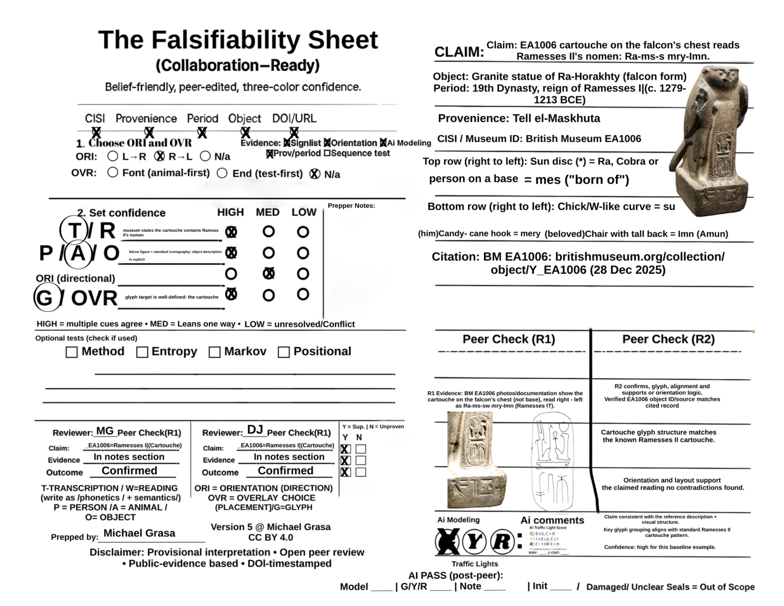

# Echoes of the Script — OpenLab

Everybody in the room has interpretations, and AI can make those interpretations sound more certain than they really are.

That is the problem this project exists to address.

---

## The Real Problem

Someone uploads a photo of a seal, an inscription, or a cartouche to a language model. The model returns a fluent, confident reading. It sounds right. It might even be right.

But a second person looking at that claim has no way to see:

- what evidence was actually used,
- what was observed versus what was inferred,
- whether AI was treated as evidence or just logged as input,
- or whether anyone else reviewed the claim independently.

And that gap is compounding. AI-assisted interpretation is entering heritage scholarship faster than verification standards. Interpretations harden. Confidence builds on confidence. The places where nobody actually knows — the real voids — get papered over instead of marked.

The result is not necessarily bad scholarship. It is **unauditable** scholarship — claims circulating without a way to inspect the pressure points, test the evidence, or surface honest disagreement.

---

## What This Project Is

A workflow built to expose the pressure points: where evidence is strong, where interpretation begins, where reviewers disagree, and where the void remains.

The central deliverable is not a tool, a platform, or a model. It is a **claim record** — a portable, versioned, citable evidence packet that bundles one claim about one artifact with bounded evidence, uncertainty labels, AI logs, and two independent reviewer outcomes. This unit did not previously exist in the field.

The core principle: **AI is logged input, not authority.**

The workflow is **model-agnostic** (works with Claude, GPT, Gemini, or no AI at all), **human-auditable** (every decision is logged on one page), and **DOI-anchored** (completed records are archived on Zenodo with persistent identifiers).

---

## The Easiest Way In

Open the completed Ramesses II example. One claim. One artifact. Evidence logged. Both peer reviews recorded. Outcome: Confirmed.

**[→ Open the worked example (PDF)](worked-examples/Falsifiability_Sheet_v5vai2_RamessesII_WorkedExample.pdf)**

A completed sheet shows the claim. The [second-reviewer sheet](templates/Second_Reviewer_Blank_Template.pdf) shows whether the claim survives independent pressure. Without a second reviewer, a sheet is provisional. With independent review recorded, it becomes meaningfully auditable.

Three documents, three purposes:

1. **The worked example** — a finished, reviewed sheet so you can see what done looks like.
2. **The [second-reviewer blank](templates/Second_Reviewer_Blank_Template.pdf)** — where an independent reviewer pressure-tests the claim for contradictions, alternatives, or gaps.
3. **The [blank sheet](templates/Falsifiability_Sheet_v5vai2_Blank.pdf)** — where you record your own claim and evidence from scratch.

If you read one thing, read the worked example. If you want to understand the method in motion, read it alongside the second-reviewer sheet.




---

## Why This Matters Beyond Egypt

The Ramesses II example is not the point. It is the **calibration**.

Egyptian offers ground-truth: published sign lists, well-documented artifacts, consensus readings. If the claim record produces the wrong outcome on a known case, the protocol is broken. Starting where answers exist lets us test the method before extending into harder territory.

The real work ahead is partially deciphered material like Meroitic, contested readings, and eventually undeciphered systems — cases where "Defer" and "Unproven" are the expected honest outcomes, not failures. These are also the cases where unchecked interpretations do the most damage, because there is less consensus to push back against a confident-sounding claim.

The protocol exists for the cases where nobody in the room is certain — and where a confident-sounding AI output can do the most damage if no one pressure-tests it.

---

## The Deeper Question

This project is not mainly about being right.

It is about making it possible to see — on one page — where evidence is strong, where interpretation begins, where two reviewers disagree, and where the real void still is. Those are the pressure points that matter, and they are exactly what gets lost when a claim circulates without structure.

The question behind the workflow:

> **How do we build a process that helps adults disagree well, surface the real voids, and test whether AI is helping — versus merely reinforcing confidence?**

The claim record is one answer. It forces every claim into a bounded format where evidence, uncertainty, AI involvement, and reviewer disagreement are all visible on the same page. It does not resolve disagreement. It makes disagreement **readable**.

That is an open problem. This workflow is one attempt. If you see a better way to test it, that is exactly the kind of contribution this project needs.

---

## Start Here

1. **See what done looks like** — open the [Ramesses II worked example (PDF)](worked-examples/Falsifiability_Sheet_v5vai2_RamessesII_WorkedExample.pdf).
2. **Read the one-page guide** — open [`quickstart/`](quickstart/) for every step and field label on one page.
3. **Download a [blank sheet](templates/Falsifiability_Sheet_v5vai2_Blank.pdf)** and a [second-reviewer blank](templates/Second_Reviewer_Blank_Template.pdf).
4. **Try the workflow on one small case** — start with well-understood material to learn the form before tackling contested or undeciphered scripts.

---

## The Full Method

What follows is the step-by-step workflow, the AI logging protocol, and the field-level reference. Read this when you are ready to use the sheet — not before you have seen the problem it exists to solve.

---

## How the Workflow Works

At a high level:

**claim → fill sheet → reviewer 1 → reviewer 2 → outcome**

A completed sheet carries weight because it passed every stage of this chain:

```
Claim recorded          →  One testable statement about one artifact
Evidence bounded        →  Sources checked and unchecked are both logged
AI logged (if used)     →  Prompt, output, and rating recorded — not hidden
Reviewer 1 checked      →  Verified the evidence trail (not just the conclusion)
Reviewer 2 checked      →  Independent stress-test for contradictions and gaps
Outcome recorded        →  Confirmed · Revise · Defer · Unproven
```

No stage can be skipped. If both reviewers are not recorded, the sheet is provisional, not verified.

### The full 12 steps

| Step | What you do |
|------|-------------|
| 1 | Pick **one artifact** and write **one testable claim** (one sentence) |
| 2 | Fill in **context**: where it's from, what period, what collection/museum, catalog ID, stable URL or DOI |
| 3 | Record **reading direction** (left-to-right, right-to-left, or mark N/A if unknown — don't guess) |
| 4 | Record **overlay/alignment choice** if you used one to map your hypothesis; mark N/A if not used |
| 5 | Check only the **evidence types you actually consulted** (sign list, object description, provenance record, etc.) |
| 6 | Set **confidence separately** for each component: transcription/reading, category (person/animal/object), reading direction, glyph/overlay |
| 7 | Write **1–3 prep notes** justifying your confidence ratings (short, factual, citeable) |
| 8 | If you used AI: paste the output into **AI comments** and rate it Green / Yellow / Red |
| 9 | **Reviewer 1**: a reviewer verifies your evidence trail (not just your conclusion) |
| 10 | **Reviewer 2**: a second reviewer stress-tests for contradictions, alternatives, or gaps |
| 11 | Log **outcome**: Confirmed / Revise / Defer / Unproven — if reviewers disagree, log both |
| 12 | **Publish** the completed sheet (PDF) with back-links to source records |

**Lean option:** A LIGHT pass logs traceability and provisional confidence (good for early-stage work). A FULL pass adds both peer reviews (required for anything public-facing).

---

## How AI Fits

AI tools (ChatGPT, Claude, Gemini, or others) can be used inside this workflow. Their role is strictly limited: **AI is logged input, not authority.**

**AI can:**
- suggest interpretations or possible readings,
- summarize visible patterns,
- help generate comparison ideas,
- support structured note-taking.

**AI cannot:**
- act as final authority on any claim,
- replace reviewer judgment,
- raise confidence on its own,
- count as evidence.

### What gets logged

When AI is used, the sheet records:

| Field | Example |
|---|---|
| **Prompt used** | "Identify the cartouche glyphs in this image of EA1006" |
| **Output used** | "The cartouche reads Wsr-Mꜣꜥt-Rꜥ Stp-n-Rꜥ (Ramesses II throne name)" |
| **Accepted or rejected** | Accepted — consistent with published BM catalog reading |
| **Sources checked against** | Kitchen, *Ramesside Inscriptions* vol. II; BM online catalog |
| **Model / version / date** | ChatGPT-4o, 2025-01-15 |

Both peer reviewers see this log and rate the AI output using a traffic light:

- **Green:** AI output is supported by the physical evidence and published sources.
- **Yellow:** AI output is plausible but incomplete — evidence doesn't fully confirm or deny it.
- **Red:** AI output is contradicted by the evidence, or makes unsupported leaps.

The real question is never "Did you use AI?" The real question is: **"Does the evidence support what the AI suggested?"**

---

## What This Is Not

This project **does not claim full decipherment of any undeciphered script.** That is an explicit non-goal.

Its contribution is different: it makes gaps, evidence, uncertainty, and reviewer disagreement **legible** through repeatable claim records and independent review.

The question is never "What does this script say?" — the question is "Is this claim about this artifact supported by bounded evidence, and do two independent reviewers agree?"

---

## Who This Is For

**Primary:** Anyone making or reviewing claims about high-uncertainty heritage material — inscriptions, seals, tablets, and artifacts where evidence is incomplete, contested, or absent.

- Epigraphers and paleographers working with partially deciphered or undeciphered scripts
- Researchers evaluating AI-generated readings of ancient writing
- Heritage scholars who need auditable evidence trails for contested interpretations
- Reviewers and editors who need a structured way to assess claim quality

**Secondary:** Methodologists and funders interested in verification infrastructure.

- Digital humanities scholars building reproducible workflows
- Grant reviewers assessing evidence rigor in AI-assisted projects
- AI accountability researchers studying how model outputs are audited in practice

---

## How This Differs from Existing Tools

| Tool / approach | What it does | What it doesn't do |
|---|---|---|
| **TEI-XML / annotation layers** | Encodes textual structure and markup | Does not bundle evidence, uncertainty, and reviewer outcomes into a single auditable unit |
| **Hypothes.is / margin comments** | Enables inline discussion | No structured claim format, no bounded evidence, no formal review roles |
| **Peer review (traditional)** | Evaluates full papers post-publication | Does not operate at the level of a single claim about a single artifact |
| **This project (claim record)** | Bundles one claim + bounded evidence + AI log + R1/R2 outcomes into a portable, citable, falsifiable review object | Does not replace full publication, annotation, or corpus-level analysis |

The claim record operates at a different level of granularity: **one claim, one artifact, one auditable packet.** Nothing else in the field currently provides this.

---

## Current Build

| | |
|---|---|
| **Status** | Prototype — actively maintained |
| **Repo version** | v1.0-alpha |
| **Sheet version** | Falsifiability Sheet v5 |
| **License** | [MPL-2.0](LICENSE) (code) · CC BY 4.0 (sheet content) |
| **Zenodo** | [zenodo.org/records/18518231](https://zenodo.org/records/18518231) |
| **Cite this** | See [CITATION.cff](CITATION.cff) |

### Usable now

- Full paper/PDF-based workflow — no software installation required
- Blank template and second-reviewer template (downloadable PDFs)
- One completed worked example with both peer reviews
- Quick-start guide with field glossary
- Zenodo integration for archival and community submission ([zenodo.org/records/18518231](https://zenodo.org/records/18518231))
- **Machine-readable by design:** The Falsifiability Sheet is structured so that any multimodal AI (Claude, GPT-4, Gemini) can ingest a completed sheet directly from a photo or scan — enabling future automated meta-analysis across claim records without tooling migration

### Coming next

- Additional worked examples across different script traditions
- Web-based form with structured data output (JSON)
- Validation tooling to auto-check field completeness and consistency
- Scalable deployment across institutions and research communities

---

## Submit Your Work

Interested in testing the workflow on a real case? I'm currently looking for:

- 2–3 serious testers willing to run the sheet on their own material,
- reviewer feedback on the workflow and field labels,
- and pilot collaborators who want to stress-test the method on real cases.

To submit a completed sheet to the community archive:

1. Read the [Zenodo record abstract](https://zenodo.org/records/18518231) — it explains how community submission works
2. Complete both peer reviews (Reviewer 1 and Reviewer 2)
3. Submit your finished sheet to the Zenodo community using the instructions in the abstract

To get in touch: [mlge9900@gmail.com](mailto:mlge9900@gmail.com)

---

## Repository Structure

```
quickstart/       → One-page quick-start guide (PDF)
templates/        → Blank sheet + second-reviewer sheet (PDFs)
worked-examples/  → Ramesses II fully worked example (PDF)
assets/           → Images used in this README
```

---

## Field Labels (glossary)

The sheet uses short labels to fit on one page. Here's what they mean:

| On the sheet | What it means |
|---|---|
| **CISI** | Collection/Institution + stable identifier (e.g., "British Museum EA1006") |
| **ORI** | Orientation — the reading direction you chose (left-to-right, right-to-left, or N/A) |
| **OVR** | Overlay — an alignment or mapping you applied to test your hypothesis; N/A if not used |
| **T/R** | Your confidence in your transcription/reading of the text |
| **P/A/O** | Your confidence in categorizing what's depicted (Person, Animal, or Object) |
| **G / G-OVR** | Your confidence in glyph identification and/or overlay placement |
| **R1** | Reviewer 1 — verifies the evidence trail |
| **R2** | Reviewer 2 — stress-tests for contradictions and gaps |
| **AI G/Y/R** | AI traffic light — Green (supported), Yellow (incomplete), Red (contradicted) |
| **Out of scope** | Damaged or unclear artifacts, or claims that can't be responsibly tested with available evidence |

---

## Versioning

This project has three version numbers. They are independent:

| What | Current | Meaning |
|---|---|---|
| **Repository** | v1.0-alpha | The GitHub repo structure, docs, and templates |
| **Falsifiability Sheet** | v5 | The one-page review form (field layout, labels, sections) |
| **Workflow maturity** | Prototype | The overall readiness level for public use |

The sheet version (v5) is higher than the repo version (v1.0-alpha) because the sheet went through several iterations before this repository was created. This is normal — the method predates the repo.

---

## Support the Open Lab

Echoes of the Script is a fiscally sponsored project of [Fractured Atlas](https://fundraising.fracturedatlas.org/echoes-of-the-script-public-decoding-pop-ups), a non-profit arts service organization. Donations fund workflow updates, new worked examples, open research infrastructure, and future digitization of the sheet into a web-based tool.

[Support the lab via Fractured Atlas](https://fundraising.fracturedatlas.org/echoes-of-the-script-public-decoding-pop-ups)

---

## License

[Mozilla Public License 2.0](LICENSE)

Created by Michael Grasa. Falsifiability Sheet content is CC BY 4.0 (where applicable).
